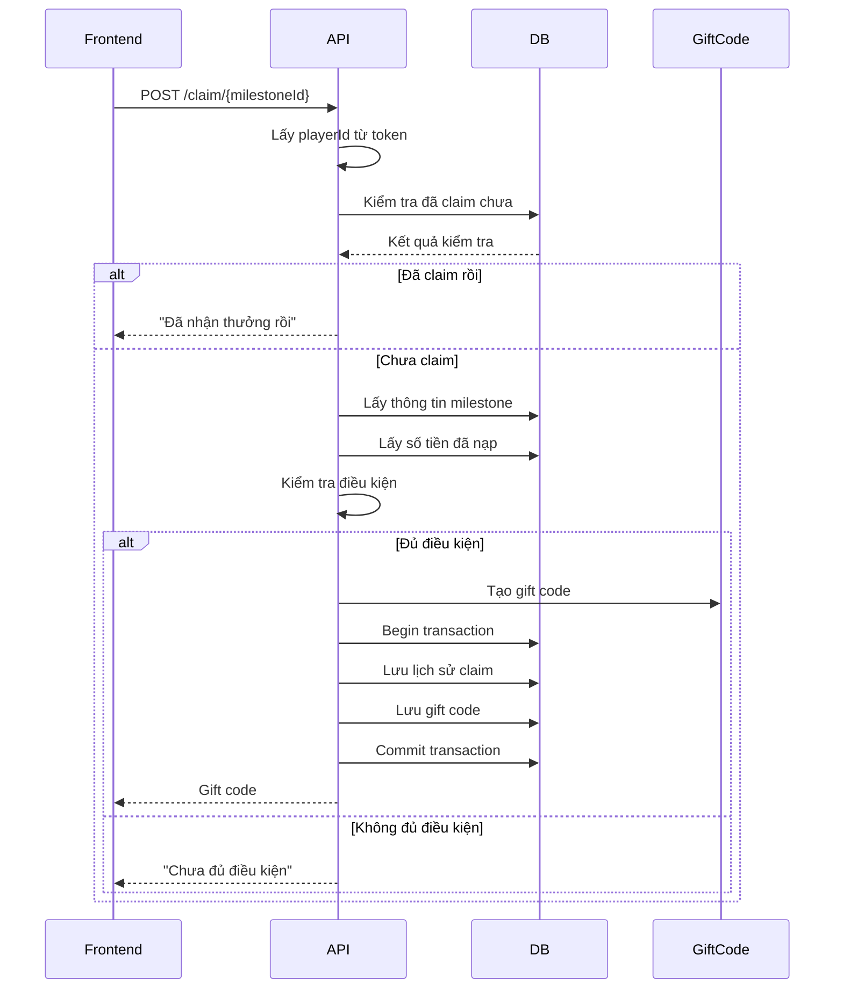

# API Documentation - Milestone Claim

## API Nhận Thưởng Mốc (Milestone Claim)

### 🎯 Tổng quan
API này cho phép người chơi nhận thưởng khi đạt các mốc nạp tiền. Khi thỏa mãn điều kiện, hệ thống sẽ tự động tạo gift code cho người chơi.

---

## 📋 Endpoint Chính

### **POST** `/api/UserMilestoneClaim/claim/{milestoneId}`

Nhận thưởng cho mốc cụ thể.

#### **Request Parameters**
- **milestoneId** (integer, path parameter) - ID của mốc thưởng muốn nhận

#### **Headers**
```http
Content-Type: application/json
Authorization: Bearer <JWT_TOKEN>
```

#### **Response Format**
```json
{
  "status": boolean,
  "statusMessage": "string",
  "data": "string" // Gift code nếu thành công
}
```

#### **Response Examples**

**✅ Thành công:**
```json
{
  "status": true,
  "statusMessage": "Nhận thưởng thành công",
  "data": "ABC1234567"
}
```

**❌ Chưa đủ điều kiện:**
```json
{
  "status": false,
  "statusMessage": "Bạn chưa đủ điều kiện nhận mốc này",
  "data": null
}
```

**❌ Đã nhận rồi:**
```json
{
  "status": false,
  "statusMessage": "Bạn đã nhận thưởng mốc này rồi",
  "data": null
}
```

**❌ Chưa tạo nhân vật:**
```json
{
  "status": false,
  "statusMessage": "Bạn chưa tạo nhân vật",
  "data": null
}
```

#### **HTTP Status Codes**
- `200 OK` - Request thành công (kiểm tra field `status` để biết kết quả)
- `401 Unauthorized` - Token không hợp lệ hoặc không có token
- `500 Internal Server Error` - Lỗi server

---

## 🔍 Endpoint Hỗ trợ

### **GET** `/api/UserMilestoneClaim/user/{userId}/milestone/{milestoneId}/claimed`

Kiểm tra xem user đã nhận mốc thưởng chưa.

#### **Request Parameters**
- **userId** (long, path parameter) - ID của user
- **milestoneId** (integer, path parameter) - ID của mốc thưởng

#### **Response**
```json
{
  "success": boolean,
  "result": boolean,
  "message": "string"
}
```

### **GET** `/api/UserMilestoneClaim/user/{userId}`

Lấy danh sách tất cả mốc thưởng mà user đã nhận.

#### **Response**
```json
{
  "success": boolean,
  "result": [
    {
      "userId": 123,
      "milestoneId": 1,
      "claimedAt": "2025-08-09T10:30:00",
      "milestoneReward": {
        "id": 1,
        "milestoneName": "Mốc 10,000 VND",
        "requiredScore": 10000,
        "rewardPackageId": 4
      }
    }
  ],
  "message": "string"
}
```

---

## 🔧 Cách tích hợp Frontend

### **1. Gọi API với JavaScript/TypeScript**

```javascript
// Hàm nhận thưởng mốc
async function claimMilestone(milestoneId, token) {
  try {
    const response = await fetch(`/api/UserMilestoneClaim/claim/${milestoneId}`, {
      method: 'POST',
      headers: {
        'Content-Type': 'application/json',
        'Authorization': `Bearer ${token}`
      }
    });
    
    const result = await response.json();
    
    if (result.status) {
      // Thành công
      alert(`Nhận thưởng thành công! Gift code: ${result.data}`);
      // Có thể hiển thị modal hoặc copy gift code vào clipboard
      navigator.clipboard.writeText(result.data);
    } else {
      // Thất bại
      alert(result.statusMessage);
    }
    
    return result;
  } catch (error) {
    console.error('Error claiming milestone:', error);
    alert('Có lỗi xảy ra khi nhận thưởng');
    return null;
  }
}

// Hàm kiểm tra đã nhận chưa
async function checkMilestoneClaimed(userId, milestoneId) {
  try {
    const response = await fetch(`/api/UserMilestoneClaim/user/${userId}/milestone/${milestoneId}/claimed`);
    const result = await response.json();
    return result.success ? result.result : false;
  } catch (error) {
    console.error('Error checking milestone:', error);
    return false;
  }
}
```

### **2. Sử dụng với Axios**

```javascript
import axios from 'axios';

const api = axios.create({
  baseURL: '/api',
  headers: {
    'Content-Type': 'application/json'
  }
});

// Interceptor để thêm token
api.interceptors.request.use(config => {
  const token = localStorage.getItem('token');
  if (token) {
    config.headers.Authorization = `Bearer ${token}`;
  }
  return config;
});

// Hàm nhận thưởng
export const claimMilestone = async (milestoneId) => {
  const response = await api.post(`/UserMilestoneClaim/claim/${milestoneId}`);
  return response.data;
};

// Hàm kiểm tra trạng thái
export const checkMilestoneClaimed = async (userId, milestoneId) => {
  const response = await api.get(`/UserMilestoneClaim/user/${userId}/milestone/${milestoneId}/claimed`);
  return response.data;
};
```

### **3. Component React Example**

```jsx
import React, { useState, useEffect } from 'react';

const MilestoneButton = ({ milestoneId, userId, requiredScore, currentScore }) => {
  const [claimed, setClaimed] = useState(false);
  const [loading, setLoading] = useState(false);
  
  const canClaim = currentScore >= requiredScore && !claimed;
  
  useEffect(() => {
    // Kiểm tra đã nhận chưa khi component mount
    checkMilestoneClaimed(userId, milestoneId)
      .then(setClaimed)
      .catch(console.error);
  }, [userId, milestoneId]);
  
  const handleClaim = async () => {
    if (!canClaim || loading) return;
    
    setLoading(true);
    try {
      const result = await claimMilestone(milestoneId);
      if (result.status) {
        setClaimed(true);
        // Hiển thị gift code
        alert(`Gift code: ${result.data}`);
      } else {
        alert(result.statusMessage);
      }
    } catch (error) {
      alert('Có lỗi xảy ra');
    } finally {
      setLoading(false);
    }
  };
  
  return (
    <button
      onClick={handleClaim}
      disabled={!canClaim || loading}
      className={`milestone-btn ${claimed ? 'claimed' : ''} ${canClaim ? 'can-claim' : ''}`}
    >
      {loading ? 'Đang xử lý...' : 
       claimed ? 'Đã nhận' : 
       canClaim ? 'Nhận thưởng' : 
       'Chưa đủ điều kiện'}
    </button>
  );
};
```

---

## 📊 Luồng xử lý



---

## ⚠️ Lưu ý quan trọng

1. **Authentication**: API yêu cầu JWT token hợp lệ
2. **One-time claim**: Mỗi mốc chỉ có thể nhận 1 lần
3. **Transaction**: Sử dụng database transaction đảm bảo tính nhất quán
4. **Gift code**: Có thời hạn 5 năm từ khi tạo
5. **Error handling**: Luôn kiểm tra field `status` trong response

---

## 🧪 Test API

### Curl Examples

```bash
# Nhận thưởng mốc
curl -X POST "http://localhost:5000/api/UserMilestoneClaim/claim/1" \
  -H "Content-Type: application/json" \
  -H "Authorization: Bearer YOUR_JWT_TOKEN"

# Kiểm tra đã nhận chưa
curl -X GET "http://localhost:5000/api/UserMilestoneClaim/user/123/milestone/1/claimed" \
  -H "Content-Type: application/json"
```

### Postman Collection
Bạn có thể import các endpoint sau vào Postman:
- Method: POST
- URL: `{{baseUrl}}/api/UserMilestoneClaim/claim/1`
- Headers: Authorization: Bearer {{token}}

---

## 🐛 Troubleshooting

| Lỗi | Nguyên nhân | Giải pháp |
|-----|-------------|-----------|
| 401 Unauthorized | Token không hợp lệ | Kiểm tra và refresh token |
| "Bạn chưa tạo nhân vật" | Player chưa được tạo | Yêu cầu user tạo character |
| "Đã nhận thưởng rồi" | Đã claim milestone này | Disable button hoặc ẩn đi |
| "Chưa đủ điều kiện" | Chưa đạt required_score | Hiển thị tiến độ hiện tại |
| 500 Internal Server Error | Lỗi database/server | Kiểm tra logs server |

---

## 💡 Best Practices

1. **Cache trạng thái**: Cache danh sách milestone đã nhận để tránh gọi API liên tục
2. **Loading state**: Hiển thị loading khi đang xử lý
3. **User feedback**: Thông báo rõ ràng kết quả cho user
4. **Retry mechanism**: Implement retry cho các request bị fail
5. **Gift code display**: Copy to clipboard và hiển thị modal đẹp
6. **Progress tracking**: Hiển thị tiến độ đến mốc tiếp theo
